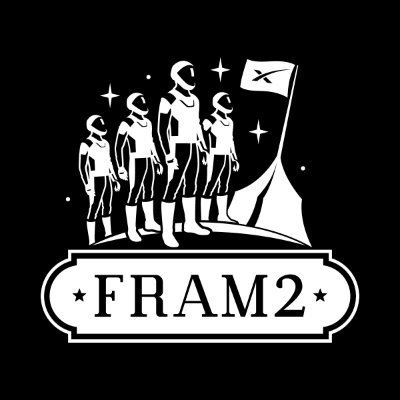

<p align="center">
  
</p>

# FRAM2: Redefining Human Spaceflight Through Polar Orbit & Web3 Innovation

<p align="center">
<i>"That's one small step for man, one giant leap for mankind." —— Neil Armstrong</i>
</p>

<p align="center">
  <a href="https://www.f2.baby/" target="_blank">🌐 Official Website</a> | 
  <a href="https://x.com/framonautss" target="_blank">🐦 Twitter</a>
</p>

## Pioneering Vision
Fram2 represents the vanguard of commercial space exploration—humanity's first polar orbit human spaceflight mission, scheduled for launch on March 31, 2025. This unprecedented venture transcends traditional spaceflight paradigms, uniting cutting-edge aerospace technology with Web3 innovation to create an interactive bridge between space exploration and global participation.

## International Mission
Our distinguished international civilian team will embark on a transformative journey aboard SpaceX's Falcon 9 rocket from Kennedy Space Center's historic Launch Pad 39A. The mission—traversing Earth in a near-perfect polar orbit with 90° inclination every 93 minutes—will conduct revolutionary observations of Earth's polar regions while establishing a new model for public engagement in space endeavors through advanced blockchain technology.

## Elite Crew
* **Chun Wang (China)**: Mission Commander, entrepreneur in space exploration and Web3 sectors
* **Jannicke Mikkelsen (Norway)**: Film director and Vehicle Commander
* **Rabea Rogge (Germany)**: Robotics engineer and radio experiment specialist
* **Eric Philips (Australia)**: Polar explorer and Medical Officer

## Proprietary Technology Ecosystem
- **Blockchain Foundation**: Solana-based $FRAM token issuance through pump.fun, with strategic migration to the proprietary high-performance Fram2 Chain
- **Advanced Smart Contracts**: Sophisticated token and NFT systems specifically engineered for aerospace data transactions
- **Premium User Interface**: State-of-the-art React application with seamless Web3 wallet integration
- **Enterprise Backend**: Industrial-grade API services with secure blockchain interaction optimized for scientific data

## Core Technology Showcase

### $FRAM Token Smart Contract
```javascript
/**
 * Create a new $FRAM token
 * @param {number} decimals - Number of decimal places
 * @returns {Promise<PublicKey>} - The mint address of the token
 */
async createToken(decimals = 9) {
  try {
    // Create a new token mint
    this.tokenMint = await Token.createMint(
      this.connection,
      this.payer,
      this.payer.publicKey,
      this.payer.publicKey,
      decimals,
      TOKEN_PROGRAM_ID
    );

    console.log(`Token created: ${this.tokenMint.publicKey.toString()}`);
    return this.tokenMint.publicKey;
  } catch (error) {
    console.error('Error creating token:', error);
    throw error;
  }
}
```

### Mission NFT Implementation
```javascript
/**
 * Create a new NFT representing mission data
 * @param {string} name - Name of the NFT
 * @param {string} symbol - Symbol of the NFT
 * @param {string} uri - URI to the metadata JSON
 * @returns {Promise<PublicKey>} - The mint address of the NFT
 */
async createNFT(name, symbol, uri) {
  try {
    // Create a new token mint with 0 decimals (NFT standard)
    const mint = await Token.createMint(
      this.connection,
      this.payer,
      this.payer.publicKey,
      null, // Freeze authority - null for NFTs
      0, // 0 decimals for NFT
      TOKEN_PROGRAM_ID
    );

    // Create a token account for the payer
    const tokenAccount = await mint.getOrCreateAssociatedAccountInfo(
      this.payer.publicKey
    );

    // Mint only 1 token (NFT standard)
    await mint.mintTo(
      tokenAccount.address,
      this.payer.publicKey,
      [],
      1
    );

    // Disable further minting (required for NFT standard)
    await mint.setAuthority(
      mint.publicKey,
      null,
      'MintTokens',
      this.payer.publicKey,
      []
    );

    return mint.publicKey;
  } catch (error) {
    console.error('Error creating NFT:', error);
    throw error;
  }
}
```

## Revolutionary Features
- **First-in-class Space Data Tokenization**: Transform polar observations, atmospheric data, and aurora imagery into exclusive NFT assets
- **Decentralized Mission Governance**: $FRAM holders gain privileged access to mission decision-making processes
- **Transparent Capital Allocation**: Web3 technology enabling unprecedented global support of groundbreaking space science
- **Real-time Space-to-Earth Communication**: Direct mission data transmission to decentralized networks

## Sophisticated Technical Architecture
```
├── Blockchain Layer
│   ├── $FRAM Token Ecosystem (1 billion total supply)
│   ├── Mission Data NFT Framework
│   └── Decentralized Governance System
├── Application Layer
│   ├── Advanced Data Visualization Suite
│   ├── Multi-wallet Integration Protocol
│   └── Premium NFT Marketplace
└── Infrastructure
    ├── Enterprise-grade API Services
    ├── IPFS Decentralized Storage
    └── Quantum-resistant Authentication
```

## Frontend Integration
```jsx
function App() {
  const [walletAddress, setWalletAddress] = useState(null);
  const [activeTab, setActiveTab] = useState('token');

  const handleWalletConnect = (address) => {
    setWalletAddress(address);
  };

  return (
    <div className="app">
      <header className="app-header">
        <div className="logo">
          <h1>Fram2</h1>
          <p>First Polar Orbit Human Spaceflight with Web3</p>
        </div>
        <WalletConnect onConnect={handleWalletConnect} />
      </header>

      <main className="app-main">
        <div className="tabs">
          <button 
            className={`tab ${activeTab === 'token' ? 'active' : ''}`}
            onClick={() => setActiveTab('token')}
          >
            $FRAM Token
          </button>
          <button 
            className={`tab ${activeTab === 'nft' ? 'active' : ''}`}
            onClick={() => setActiveTab('nft')}
          >
            Mission NFTs
          </button>
        </div>
        {/* Tab content components */}
      </main>
    </div>
  );
}
```

## Strategic Development Roadmap
- **Phase 1 (Current)**: Token ecosystem and NFT platform implementation
- **Phase 2 (2025-2026)**: Enhanced governance mechanisms and scientific data visualization tools
- **Phase 3 (2026)**: Fram2 Chain launch with aerospace data optimization (>10,000 TPS)
- **Phase 4 (2027+)**: Multi-mission integration and deep space exploration support systems

## Scientific Research Portfolio
- **Polar Earth Observation**: Unprecedented monitoring of ice caps, atmosphere, and aurora phenomena
- **Aerospace Medicine**: Pioneering space X-ray diagnostics and Blood Flow Restriction training
- **Space Biology**: Groundbreaking microgravity mushroom cultivation and crop growth experiments
- **Science Communication**: Innovative Fram2Ham radio activities engaging youth worldwide

## System Requirements
- Node.js v16+
- Solana CLI tools
- Phantom or Solflare wallet

## Deployment Protocol
```bash
# Install dependencies
npm install

# Configure environment variables
cp .env.example .env
# Customize configuration parameters

# Initialize backend services
npm start

# Deploy frontend application
npm run dev:frontend
```

## Join the Future of Space Exploration
Fram2 transcends conventional spaceflight paradigms, establishing a new frontier where science, education, and Web3 converge. Experience the democratization of space through blockchain technology and become part of humanity's journey to the stars.

## Connect With Us
Stay updated on the latest developments of our groundbreaking mission:
- 🌐 **Official Website**: [https://www.f2.baby/](https://www.f2.baby/)
- 🐦 **Twitter**: [@framonautss](https://x.com/framonautss)
- 💬 Join our community to participate in the first Web3-powered human spaceflight

---

<p align="center">
© 2025 Fram2 Team | "Science Without Boundaries, Exploring the Poles — A New Milestone in Human Spaceflight"
</p> 